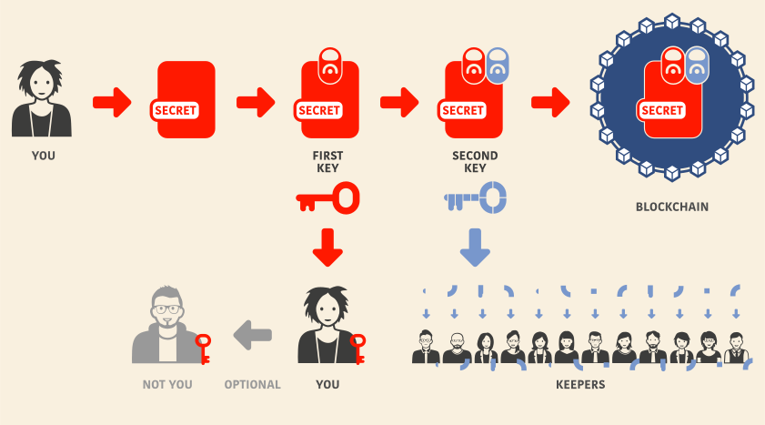
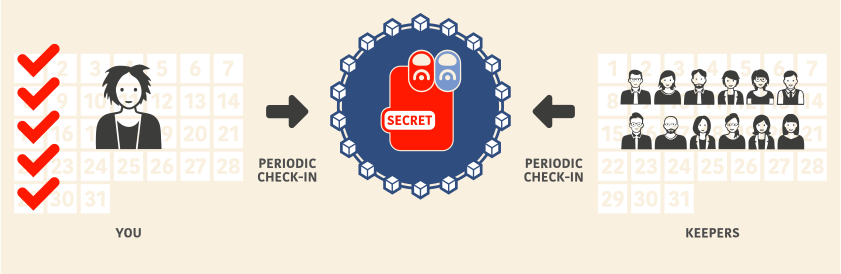
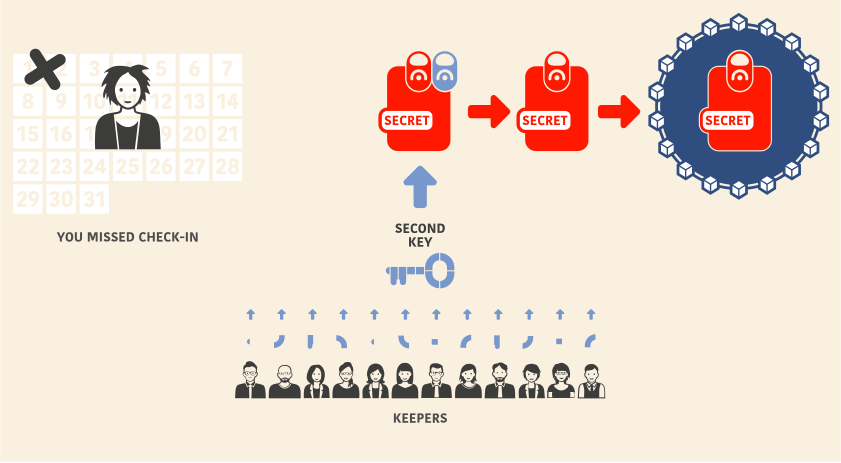

*Bitcannery* time-locks an encrypted message on a blockchain to be auto-decrypted at a set point in time. 
That point in time can be continuously pushed forward by the sender. 

This is useful for timed-out message delivery, dead-man-switch-like applications, data escrow, data leaks, last-resort backups, disaster recovery, etc.

At the moment it is implemented on the Ethereum blockchain, but it doesn't have to be bound to Ethereum. *Bitcannery* system can be generalized for virtually any distributed ledger supporting smart contracts.

You can find a [source code on Github](https://github.com/bitcannery/bitcannery-cli).  
To download the binary and see some usage examples please visit the [How-to](https://bitcannery.net/howto).  
For more detailed information please read the [Lightpaper](https://bitcannery.net/lightpaper).

Contact us: [pavel@bitcannery.net](mailto:pavel@bitcannery.net).

## How it works?

* You have an information you want to keep. We call it a "secret" and you are a "secret owner" in this scenario.

* Using *Bitcannery*, you encode a secret locally with the first key.

* *Bitcannery* generates a second key, encodes the secret one more time and publishes the double encrypted secret on the blockchain.

* *Bitcannery* then splits the second key in chunks and distribues them between agents (using [Shamir's Secret Sharing algorithm](https://en.wikipedia.org/wiki/Shamir%27s_Secret_Sharing)) who keep the chunks on their machines. We call them the "keepers".

* Using *Bitcannery*, you perform a predefined periodic action (run some script or visit some website). We call it a "check-in".

* As long as you check-in, your secret is encoded.

* When you stop checking-in, keepers return their key parts and the second key is
re-assembled. Your secret gets decoded and published on the blockchain.

## Security

Keepers are unaware of which secret they're keeping, so even if majority of the keepers are malicious it's very hard for them to reconstruct a complete key. For a succesful Sybil attack, 66% of all keepers would have to cooperate. Even if it's done somehow (by identifying the existing keepers or by flooding the system with the new ones), the attacker would only get the data encrypted with the first key, kept privately by the secret owner.

## Economy

To motivate the keepers, simple monetary model is used. Every keeper earns a fee for performing his/her part. Fee is set by the secret owner, so it's up to each keeper to accept specific keeping contract or not.

There is a rating system planned which would make sure stable and honest keepers are paid higher (not implemented yet).
